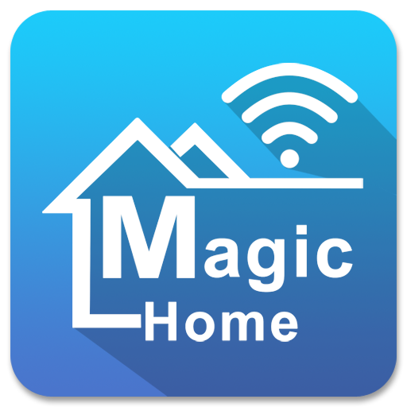

<div style="display:flex;flex-direction: column; justify-content: center; gap:0; text-align: center">
<div style="display:flex;flex-direction: row; justify-content: center; gap: 1rem; text-align: center">
  
  
</div>
<h1 align="center" style="padding: 0;margin: 0">Raycast Magic Home Extension</h1>
</div>

---

A Raycast extension to discover and control Magic Home LED compatible devices.

## Getting Started

1. Clone this repository:
   ```sh
   git clone https://github.com/bcarusodev/magic-home-raycast.git
   ```
2. Navigate to the project directory:
   ```sh
   cd magic-home-raycast
   ```
3. Install dependencies:
   ```sh
   npm install
   ```
4. Link the extension with Raycast:
   ```sh
   npm run dev
   ```

## Usage

1. Open Raycast (`⌘ + Space` by default)
2. Search for "Discover"
3. Select your device from the list and add to My Devices
4. Go to "My Devices" command, you can control the added device through it